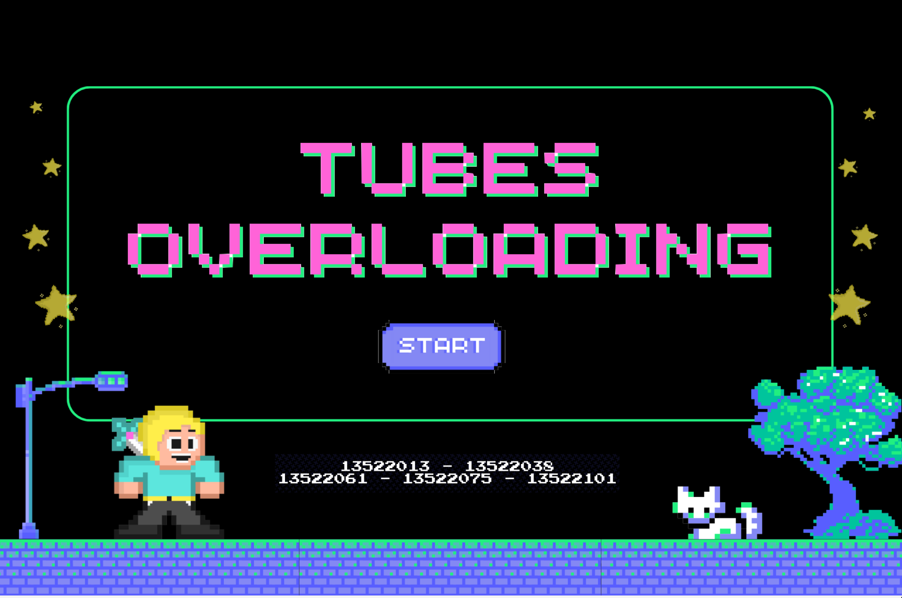
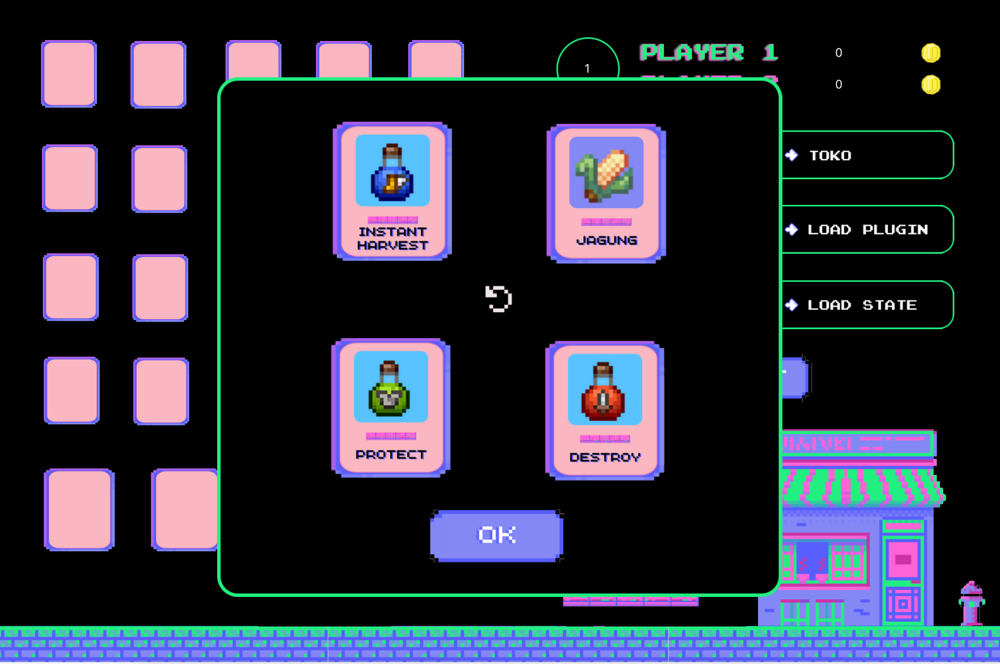
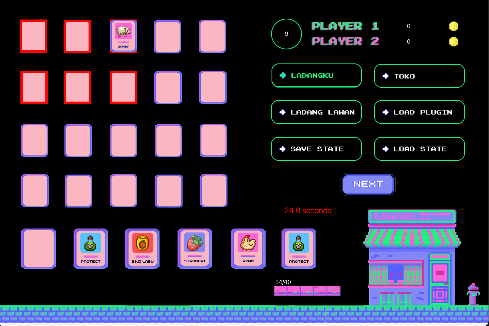
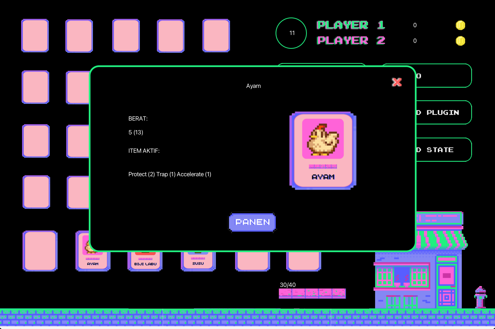
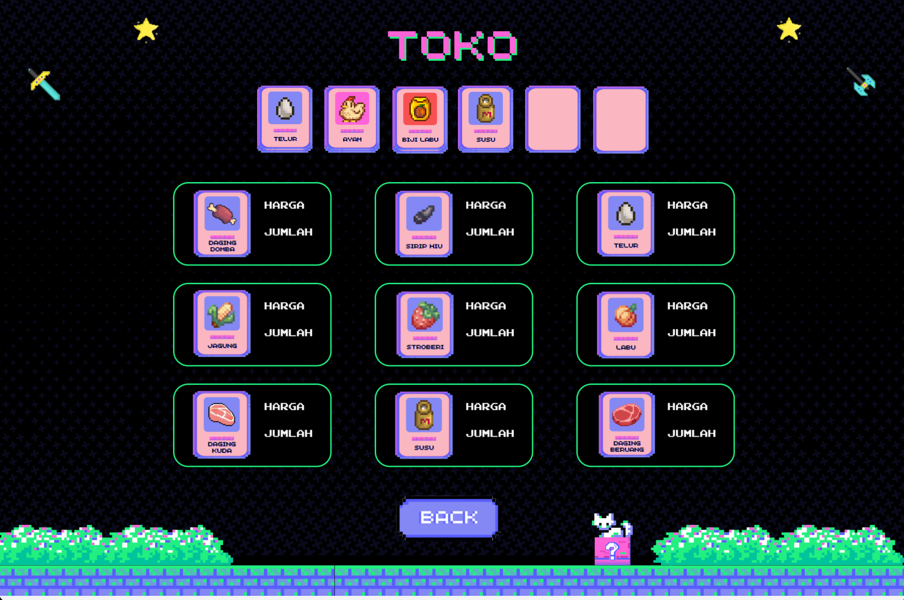
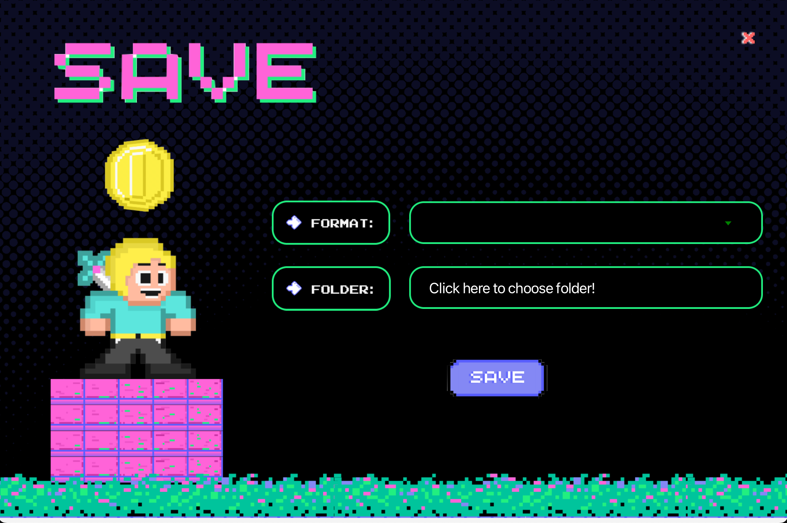
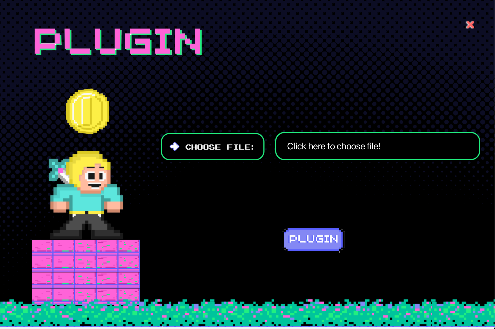

# Remidi Kelola Kerajaan
> Program java sederhana untuk mensimulasikan permainan kartu menggunakan GUI javaFX


## Table of Contents
- [Project Name](#project-name)
  - [Table of Contents](#table-of-contents)
  - [General Information](#general-information)
  - [Technologies Used](#technologies-used)
  - [Features](#features)
  - [Screenshots](#screenshots)
  - [Setup](#setup)
  - [Project Status](#project-status)
  - [Room for Improvement](#room-for-improvement)
  - [Acknowledgements](#acknowledgements)
<!-- * [License](#license) -->


## General Information
Permainan yang kami buat adalah permainan kartu *drag and drop* yang dibuat menggunakann Java dengan framework JavaFX sebagai kakas GUI.

Permainan *Remidi Kelola Kerajaan* dimulai dengan dua pemain. Pemain pertama akan mendapatkan 4 kartu secara random yang dapat di*shuffle* ulang sampai mendapatkan kartu - kartu yang diinginkan, kartu tersebut kemudian akan ditempatkan pada *active deck* pemain yang memiliki slot maksimal 6 kartu. Setelah fase *shuffle*, pemain dapat melakukan berbagai hal yakni menanam kartu *creature* dari *active deck* ke ladang, menggunakan kartu *item* yang efeknya bervariasi, memberi makan kepada kartu *creature* pada ladang, memanen kartu di ladang yang siap dipanen, dan lain - lain. Pada awal *shuffle* terdapat kemungkinan pemain terkena serangan beruang, pada fase tersebut pemain memiliki waktu tertentu (acak antara 30 dan 60 detik) untuk memindahkan kartu pada ladangnya yang ditargetkan beruang ke subgrid yang lain.

Permainan kita juga menyediakan fitur *Plugin* yang dapat digunakan untuk menambahkan format berkas yang dapat di muat atau simpan.


## Technologies Used
- Java version 21.0.0 or higher
- Apache Maven 3.8.0 or higher
- JavaFX version 21.0.0

## Features
- Drag and drop cards
- Plugin
- Shop
- Bear Attack

## Screenshots
</br></br>
</br></br>
</br></br>
</br></br>
</br></br>
</br></br>
</br></br>
</br></br>
<!-- If you have screenshots you'd like to share, include them here. -->


## Setup
### Prerequisites
- Apache Maven
- Java version 21 or higher

### Compile and run
```shell
mvn clean install
java -jar target/oop2-0.0.1.jar
```


## Project Status
Project is:  _complete_  

## Room for Improvement

Things to improve:
- Improve design pattern
- Improve object-oriented programming implementation


To do:
- Flexible grid size (can change grid size)
-  Unit Testing


## Acknowledgements
- Denise Felicia Tiowanni (13522013)
- Francesco Michael Kusuma (13522038)
- Maximilian Sulistiyo (13522061)
- Marvel Pangondian (13522075)
- Abdullah Mubarak (1352210)


